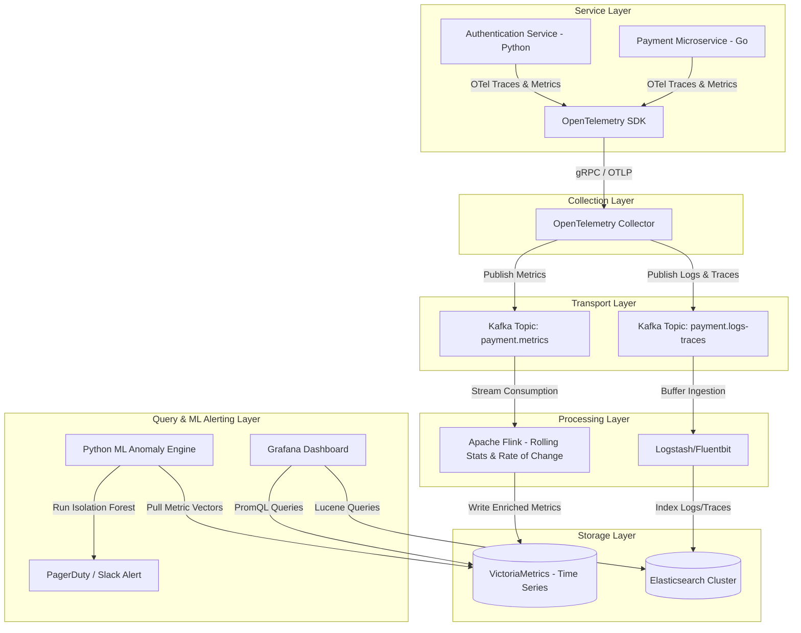

# BÁO CÁO HOÀN THÀNH ASSIGNMENT: DAY 3 - ARCHITECTURE, COST & ADR

Họ và tên học viên: **Nguyễn Thanh Tâm**  
Lớp: **AIOps - Week 1 - Day 3**

---

## 1. Sơ đồ Kiến trúc Hệ thống (Architecture Diagram)

Hệ thống được thiết kế phục vụ cho use case **"Anomaly Detection trên Payment Service"**. Chi tiết sơ đồ luồng dữ liệu truyền dẫn (Mermaid Flowchart) dưới đây biểu diễn cách luồng telemetry được thu thập, xử lý trực tuyến qua Kafka/Flink và lưu trữ phân lớp:

*Xem thêm tài liệu chi tiết tại:* [architecture.md](file:///c:/Users/LENOVO/Desktop/Assignment-1/aiops-ThanhTam/w1/day-3/architecture.md)

---

## 2. Bảng Ước tính Chi phí (Cost Estimation Comparison)

Bảng dưới đây so sánh chi phí hàng tháng giữa việc **Mua dịch vụ SaaS (Datadog)** và **Tự triển khai (Build - AWS Self-Host)** trên 3 phân lớp quy mô hệ thống (Small, Medium, Large):

| Tier | Scale Details | Component | Buy (Datadog Monthly) | Build (AWS Self-Host Monthly) |
|:---|:---|:---|:---|:---|
| **Small** | - 10 services - 50 GB logs/day - 100,000 events/s | **Compute** | - | $515.00 |
| | | **Storage** | $3,750.00 (Logs) | $189.66 (VM + ES) |
| | | **Metrics** | $50,000.00 | - |
| | | **Network** | Included | $99.00 |
| | | **Engineering** | Included | $2,500.00 (0.2 FTE) |
| | | **TOTAL** | **$53,750.00** | **$3,303.66** (Infra: $803.66) |
| | | | | |
| **Medium** | - 100 services - 500 GB logs/day - 1,000,000 events/s | **Compute** | - | $2,120.00 |
| | | **Storage** | $37,500.00 (Logs) | $1,896.56 (VM + ES) |
| | | **Metrics** | $500,000.00 | - |
| | | **Network** | Included | $990.00 |
| | | **Engineering** | Included | $6,250.00 (0.5 FTE) |
| | | **TOTAL** | **$430,000.00** (after 20% disc.) | **$11,256.56** (Infra: $5,006.56) |
| | | | | |
| **Large** | - 1000 services - 5000 GB logs/day - 10,000,000 events/s | **Compute** | - | $10,200.00 |
| | | **Storage** | $375,000.00 (Logs) | $18,965.60 (VM + ES) |
| | | **Metrics** | $5,000,000.00 | - |
| | | **Network** | Included | $9,900.00 |
| | | **Engineering** | Included | $18,750.00 (1.5 FTE) |
| | | **TOTAL** | **$3,225,000.00** (after 40% disc.) | **$57,815.60** (Infra: $39,065.60) |
| | | | | |

*Chi tiết thuật toán tính toán tại:* [cost_model.py](file:///c:/Users/LENOVO/Desktop/Assignment-1/aiops-ThanhTam/w1/day-3/cost_model.py)

---

## 3. Tóm tắt Quyết định Thiết kế Kiến trúc (ADR Summary)

* **Quyết định (Decision):** Lựa chọn **Tự cài đặt (Build - VictoriaMetrics + Elasticsearch + Kafka)** khi hệ thống đạt quy mô từ **Medium** trở lên. Ở quy mô **Small**, ưu tiên chọn **Mua SaaS (Buy - Datadog)**.
* **Lý do (Context/Trade-off):** 
  * Ở quy mô lớn, chi phí sử dụng Datadog tăng vọt theo số lượng custom metric series (lên tới hơn $3.2 triệu/tháng ở mức Large). Việc tự host giúp giảm chi phí hạ tầng xuống 98% (chỉ còn ~$57k/month bao gồm cả chi phí kỹ sư vận hành).
  * Bảo đảm dữ liệu giao dịch tài chính nhạy cảm của Payment Service hoàn toàn nằm trong VPC của doanh nghiệp, đáp ứng các tiêu chuẩn bảo mật PCI-DSS và GDPR.
  * Giảm độ trễ phát hiện cảnh báo bất thường xuống dưới 10 giây nhờ xử lý luồng (Stream Processing) bằng Flink thay vì chờ 1-2 phút của SaaS.

*Chi tiết bản ghi ADR tại:* [ADR-001.md](file:///c:/Users/LENOVO/Desktop/Assignment-1/aiops-ThanhTam/w1/day-3/ADR-001.md)

---

## 4. Reflection (Đánh giá & Khuyến nghị thực tế)

### Bối cảnh giả định:
Bạn được tuyển làm **Platform Engineer** cho một startup công nghệ có quy mô **50 dịch vụ (services)** vừa gọi vốn thành công vòng **Series A**.

### Khuyến nghị:
Tôi sẽ đề xuất phương án **BUY (Sử dụng dịch vụ SaaS như Datadog hoặc Grafana Cloud)** ở giai đoạn này.

### Tại sao?
1. **Tập trung vào giá trị cốt lõi (Core Business):** Startup giai đoạn Series A cần tốc độ phát triển sản phẩm cực nhanh để tìm kiếm Product-Market Fit (PMF). Việc cử kỹ sư thiết lập và tự vận hành cụm Kafka, Elasticsearch, và VictoriaMetrics sẽ tiêu tốn tài nguyên kỹ thuật vô cùng lớn thay vì tập trung code tính năng phục vụ khách hàng.
2. **Chi phí cơ hội của kỹ sư (Engineering Opportunity Cost):** Chi phí trả lương cho 1 kỹ sư DevOps/Platform chuyên trách vận hành hệ thống tự host lớn hơn rất nhiều so với hóa đơn Datadog/Grafana Cloud ở quy mô 50 dịch vụ. Với quy mô này, chi phí SaaS ước tính chỉ rơi vào khoảng vài ngàn USD/tháng, trong khi lương kỹ sư tối thiểu là $8,000 - $12,000/tháng.
3. **Chiến lược chuyển dịch lâu dài (Migration Strategy):** 
   * Chúng ta sẽ áp dụng **OpenTelemetry SDK** để viết mã instrumentation cho 50 dịch vụ ngay từ ngày đầu tiên.
   * Do OTel là mã nguồn mở và chuẩn hóa chung, mã nguồn của ứng dụng hoàn toàn không bị ràng buộc (vendor lock-in) vào Datadog.
   * Khi startup phát triển lên quy mô lớn hơn (Medium/Large) và hóa đơn SaaS vượt quá chi phí tuyển dụng 1 Platform Engineer chuyên trách, việc chuyển đổi luồng dữ liệu từ OTel Collector sang cụm Kafka + VictoriaMetrics tự host sẽ vô cùng đơn giản và không cần thay đổi bất kỳ dòng code nào của ứng dụng.
