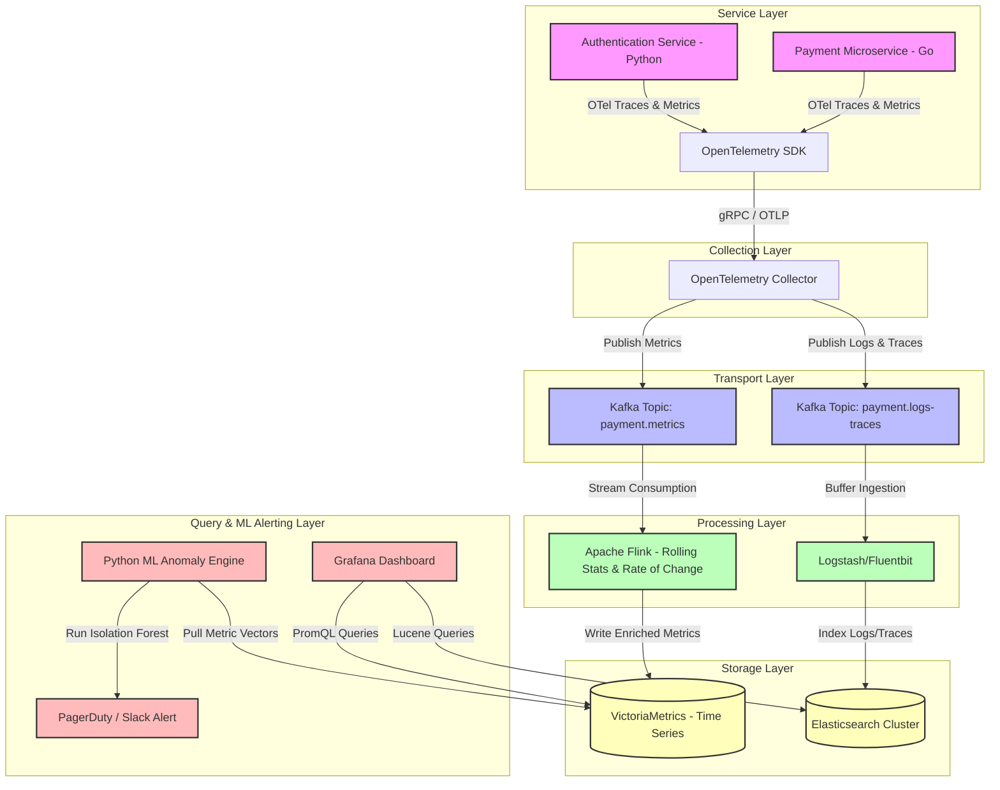

# Architecture Design: Anomaly Detection on Payment Service

This document describes the End-to-End (E2E) telemetry and anomaly detection architecture designed for a distributed **Payment Service**.

---

## 1. End-to-End Data Flow Diagram (Mermaid)

---

## 2. Component Analysis & Tool Choice

### 2.1 Service Layer
* **Role:** Processes online credit card and bank transactions, generates raw telemetry data (traces, logs, and transaction metric signals like amounts, transaction IDs, latency).
* **Tool Choice:** **Go/Python Microservices instrumented with OpenTelemetry (OTel) SDK**. 
  * *Rationale:* OTel is the industry standard for vendor-agnostic instrumentation. Go provides high performance for transaction execution, while Python handles authentication/validation layers.

### 2.2 Collection Layer
* **Role:** Receives raw telemetry from multiple instances, parses, filters, and batches data before sending it downstream to avoid overloading the pipeline.
* **Tool Choice:** **OpenTelemetry Collector (OTel Collector)**.
  * *Rationale:* Acts as a high-performance local proxy that buffers data, removes sensitive PII (like raw credit card numbers or user details), and standardizes formats to OpenTelemetry Protocol (OTLP).

### 2.3 Transport Layer
* **Role:** Acts as a high-throughput, fault-tolerant message queue to buffer spikes in payment transaction logs and metrics, decoupling collection from processing.
* **Tool Choice:** **Apache Kafka (Confluent / Managed MSK)**.
  * *Rationale:* Offers partitioned, distributed logs with microsecond latency. Can handle millions of events per second and allows parallel processing by downstream consumers.

### 2.4 Processing Layer
* **Role:** Performs real-time stream aggregation, anomaly calculations (e.g. rolling transaction failure rates, sliding window velocity detection) as events pass through.
* **Tool Choice:** **Apache Flink**.
  * *Rationale:* Flink is ideal for stateful, low-latency stream processing on event time. It calculates sliding rolling averages and variances of transaction amounts and failure codes over 1-minute and 5-minute windows.

### 2.5 Storage Layer
* **Role:** Persists telemetry data for long-term auditing and near-real-time querying.
* **Tool Choices:**
  * **VictoriaMetrics (Metrics):** An extremely lightweight, high-performance time-series database. Chosen over Prometheus for its lower memory footprint, superior compression ratios, and native clustering.
  * **Elasticsearch (Logs & Traces):** Used for indexing distributed transaction traces and application logs to support fast search and distributed debugging.

### 2.6 Query & Machine Learning Layer
* **Role:** Provides observability dashboards, queries metrics, and hosts automated anomaly detection models to alert engineers on issues (e.g. sudden drop in checkout rates).
* **Tool Choices:**
  * **Grafana:** Displays real-time dashboards by querying VictoriaMetrics and Elasticsearch.
  * **Custom Python ML Engine:** Runs on a scheduled interval (e.g., every 1 minute) querying VictoriaMetrics features (transaction throughput, latency, sliding standard deviations) and feeds them into an **Isolation Forest** model to flag outlier activity and trigger PagerDuty alerts.
