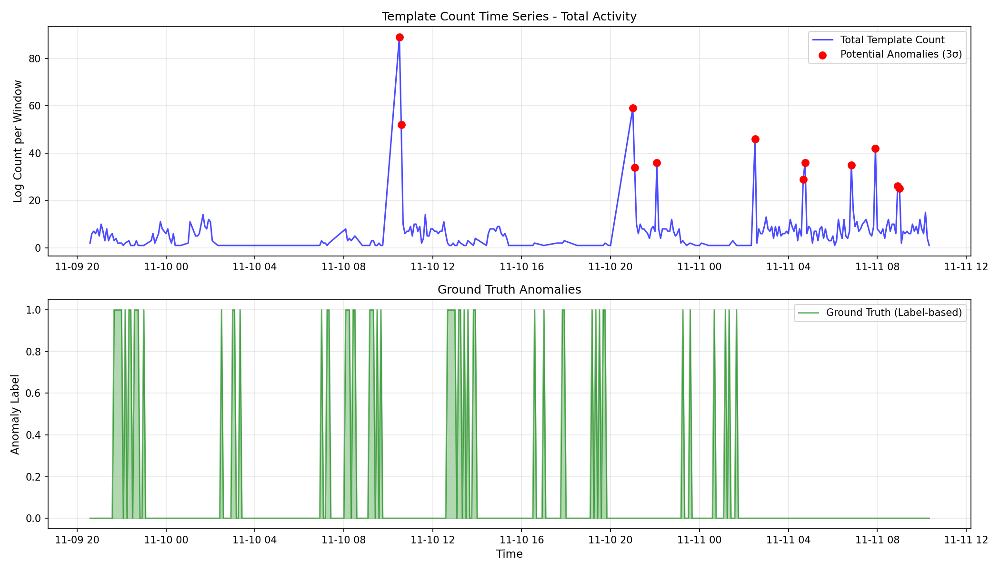
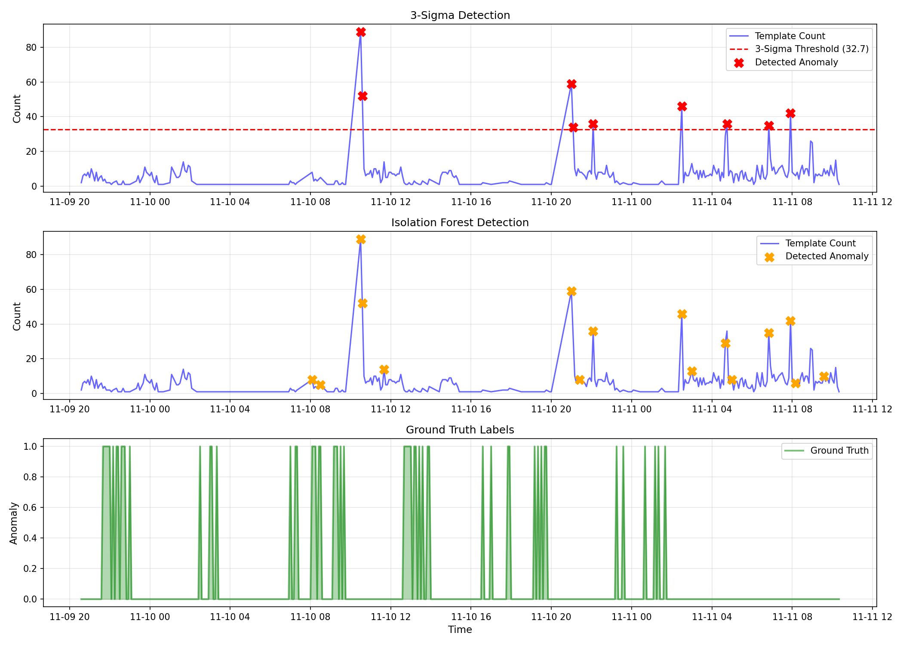

# BÁO CÁO HOÀN THÀNH ASSIGNMENT: LOG MINING & ANOMALY DETECTION WITH DRAIN3

Họ và tên học viên: **Nguyễn Thanh Tâm**  
Lớp: **AIOps - Week 1 - Day B**

---

## 1. Screenshots (Biểu đồ Chuỗi thời gian & Phát hiện Bất thường)

Dưới đây là các biểu đồ phân tích chuỗi thời gian hoạt động của log và kết quả so sánh giữa các thuật toán phát hiện bất thường:

### 📈 Hoạt động của Template theo thời gian (Template Activity Time Series)

*Biểu đồ hiển thị tần suất của các template theo chuỗi thời gian 5 phút và đánh dấu các điểm bất thường dựa trên quy tắc 3-Sigma.*

### 🚨 So sánh kết quả phát hiện bất thường (Anomaly Detection Comparison)

*Biểu đồ so sánh kết quả dự báo điểm bất thường của quy tắc 3-Sigma (3-Sigma Rule) và thuật toán Rừng cô lập (Isolation Forest) so với nhãn chuẩn gốc (Ground Truth).*

---

## 2. Logs & Kết quả kiểm nghiệm Drain3

### 📋 Kết quả phân tích HDFS Dataset (2,000 dòng log)
* **Tổng số dòng log:** 2,000
* **Số lượng templates duy nhất:** 17

#### Top-10 Templates phổ biến nhất:
1. **[Template ID 1]** (310 logs - 15.50%): `PacketResponder <*> for block <*> terminating`
2. **[Template ID 2]** (300 logs - 15.00%): `BLOCK* NameSystem.addStoredBlock: blockMap updated: <*> is added to <*> size <*>`
3. **[Template ID 4]** (291 logs - 14.55%): `Receiving block <*> src: <*> dest: <*>`
4. **[Template ID 3]** (280 logs - 14.00%): `Received block <*> of size <*> from <*>`
5. **[Template ID 7]** (262 logs - 13.10%): `Deleting block <*> file <*>`
6. **[Template ID 10]** (223 logs - 11.15%): `BLOCK* NameSystem.delete: <*> is added to invalidSet of <*>`
7. **[Template ID 5]** (114 logs - 5.70%): `BLOCK* NameSystem.allocateBlock: <*> <*>`
8. **[Template ID 8]** (79 logs - 3.95%): `<*>/<*> Served block <*> to <*>`
9. **[Template ID 9]** (79 logs - 3.95%): `<*>/<*> exception while serving <*> to <*>`
10. **[Template ID 6]** (19 logs - 0.95%): `Verification succeeded for <*>`

### ⚙️ Nhật ký tinh chỉnh tham số (Tuning drain_sim_th)
Quy trình thử nghiệm với các ngưỡng tương đồng (`drain_sim_th`) khác nhau trên HDFS Dataset cho thấy kết quả:

| Ngưỡng tương đồng (`drain_sim_th`) | Số lượng Templates tạo ra | Đánh giá chất lượng |
|:---:|:---:|:---|
| **0.3** | 17 | Tốt (gom cụm chuẩn xác, không bị phân mảnh) |
| **0.5** | 17 | Tốt (mức cân bằng tối ưu giữa gom cụm và giữ thông tin) |
| **0.7** | 700 | Kém (quá phân mảnh, sinh ra nhiều template trùng lặp cấu trúc) |

👉 **Lựa chọn:** Chọn ngưỡng **0.5** làm giá trị tốt nhất để đảm bảo mô hình phân tích log có độ tổng quát hóa tốt nhất mà không làm mất thông tin quan trọng.

---

## 3. Reflection (Nhận xét & Đánh giá bản thân)

### 🤔 Drain3 phân tích tốt không?
* **Đánh giá:** Drain3 hoạt động cực kỳ hiệu quả và nhanh chóng. Thuật toán này có khả năng xử lý log theo thời gian thực (online parsing) rất tốt. Nó tự động phát hiện được các tham số động (như Block ID, IP, dung lượng file, thời gian) và thay thế bằng ký tự đại diện `<*>` một cách chuẩn xác, giúp giảm chiều dữ liệu từ hàng ngàn log không cấu trúc về dạng có cấu trúc.

### 💡 Những templates mang lại insight quan trọng
* **Template ID 9 (`<*>/<*> exception while serving <*> to <*>`):** Đây là template quan trọng nhất để phát hiện lỗi hệ thống. Nó phản ánh trực tiếp việc các nút dữ liệu gặp ngoại lệ khi đang phục vụ block thông tin cho client.
* **Template ID 10 (`BLOCK* NameSystem.delete: <*> is added to invalidSet...`):** Cung cấp insight về các tác vụ dọn dẹp bộ nhớ hoặc giải phóng các block dữ liệu không hợp lệ (hỗ trợ phân tích quản lý vòng đời dữ liệu).

### 🔄 Phân biệt Metrics và Logs trong AIOps
* **Logs (Nhật ký sự kiện):**
  * *Bản chất:* Là dữ liệu định tính, rời rạc (discrete). Mỗi dòng log là một bản ghi chi tiết về một sự kiện cụ thể xảy ra trong hệ thống tại một thời điểm (ví dụ: lỗi kết nối, cập nhật DB, exception).
  * *Ưu điểm:* Chứa ngữ cảnh cực kỳ chi tiết (stack trace, thông báo lỗi cụ thể) giúp kỹ sư tìm ra **nguyên nhân gốc rễ (root cause)** của sự cố.
* **Metrics (Thông số đo lường):**
  * *Bản chất:* Là dữ liệu định lượng, liên tục (continuous) dưới dạng các chuỗi số (ví dụ: CPU %, dung lượng RAM, số lượng request/giây).
  * *Ưu điểm:* Dung lượng lưu trữ nhỏ, truy vấn nhanh, trực quan hóa tốt. Giúp phát hiện **xu hướng bất thường (trends)** và kích hoạt cảnh báo (alerting) sớm khi hệ thống bị quá tải.
